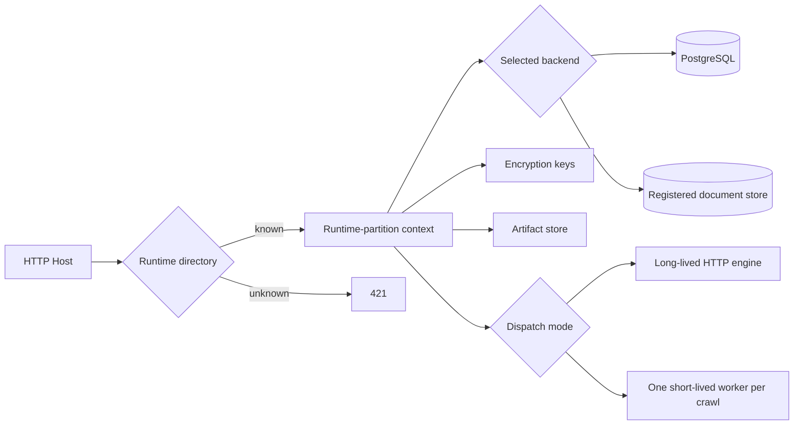

# Hosted cell integration

The public Accrawl repository remains the complete self-hosted product. It also
contains the runtime catalog and the crawl lifecycle a hosted operator needs
when workers run outside the control-plane process. What a hosted operator
supplies is registered rather than built in: where records are kept, where
screenshots go, what holds a deferred callback, how a worker proves which
execution it is, and how a crawl is handed over. Provider-specific billing,
customer onboarding, and infrastructure provisioning remain outside this
repository.

The public contract retains `tenant` in a few type and setting names for
compatibility. In this document, each such entry is an infrastructure runtime
partition: a host-routed bundle of database, secrets, storage, and worker
configuration. It is not necessarily an application-level tenant. A hosted
operator can use one shared platform partition while storing recipient
organisations inside the application without assigning them dedicated compute
or database instances.

## Runtime model

- With no `TENANT_DIRECTORY_FILE`, Accrawl runs as the existing single implicit
  self-hosted runtime.
- With `TENANT_DIRECTORY_FILE`, the control-plane resolves the HTTP `Host`
  before authentication or database access. Unknown hosts fail with `421`.
- Every request runs inside an async runtime-partition context. Database pools,
  encryption keys, engine secrets, artifact storage, and identity assertions
  are selected from that context.
- `ENGINE_DISPATCH_MODE=http` sends the crawl to a long-lived engine over the
  internal network. This is what a deployment running its own engine uses.
- A registered dispatcher writes an encrypted durable crawl job to the selected
  partition and asks the deployment to start one short-lived worker for it. The
  deployment receives routing identifiers and an expiring, attempt-bound
  claim-secret reference, never the credential-bearing payload.
- A deployment whose services can scale to zero has no running task between
  crawls. Crawls do not receive permanently reserved instances for their users,
  organisations, or runtime partitions. Nothing in this process is therefore
  trusted to remember later work: a deferred callback, held by the queue the
  deployment registered, is what brings the service back to look in on a crawl
  or to run a schedule when it falls due.

## Public contract boundary

`@accrawl/contracts` exports:

- `CellTenantCatalogSchema` for versioned placement/runtime descriptors;
- exact-host normalization;
- request-bound hosted identity assertions with separate user and
  administrative signing keys;
- AES-256-GCM durable crawl-job envelopes.

A hosted wrapper should import those contracts directly rather than copying
types or crawl logic. The `CellTenantCatalogSchema` name is a compatibility
name for this generic runtime-partition boundary. Provider metadata can live
under the catalog entry's `extensions` object; the public core ignores
provider-specific keys.

## Required hosted settings

These are the settings this repository reads. Everything a provider needs — where its store lives, which
job runner starts a worker, which identities are accepted — is configuration of the deployment that
supplies that provider, and is read there.

| Setting | Purpose |
|---|---|
| `PERSISTENCE_BACKEND` | Which registered store keeps the connection, account, transaction, holding and organization-sharing records; defaults to `postgres`, which needs no registration |
| `TENANT_DIRECTORY_FILE` | Version-1 runtime catalog; setting name retained for compatibility |
| `TRUST_INTERNAL_TENANT_HOST_HEADER=true` | Resolve the logical tenant from `x-accrawl-tenant-host` while preserving the transport Host. Only for a private core whose platform restricts who may reach it |
| `ENGINE_DISPATCH_MODE` | Which engine transport; `http` reaches a long-lived engine, and any other value selects a registered dispatcher that starts one ephemeral worker per crawl, with durable ownership admitting a single authoritative attempt |
| `SKIP_DB_BOOTSTRAP=true` | PostgreSQL only: provisioning and migrations run as explicit jobs |
| `ENGINE_ROLE_MANAGED_EXTERNALLY=true` | Database roles are created by hosted provisioning |

A hosted deployment also registers, before the server is built:

| Registration | What it supplies |
|---|---|
| `registerPersistenceProvider` | Where records are kept, and whether that store supports the hosted crawl lifecycle |
| `registerEngineDispatcher` | How a crawl is handed to a worker started outside this process |
| `registerHostedWorkerPlane` | Which caller is the worker, which is the scheduler, whether an execution is the one that was started, and where its one-use claim secret lives. Registering it is also what mounts the worker-facing routes |
| `registerScreenshotArchive` | Where step screenshots are kept when no shared disk exists |
| `registerDeferredCallbackQueue` | What holds a callback until its due time and delivers it |
| `registerFcmCredentials` | How the server proves it is the authorized sender of a Companion wake-up, for a runtime that carries an identity rather than a key file |

The catalog contract permits at most one inline-or-file source for each
secret. The runtime loader then requires only the fields used by the selected
backend and dispatch mode:

| Selected runtime | Required catalog fields |
|---|---|
| Every hosted runtime | user and administrative identity assertion keys; credential-encryption key |
| PostgreSQL | database URL |
| HTTP engine | engine shared secret |
| Ephemeral worker | screenshot store placement; crawl-job encryption key |
| Registered document store + ephemeral worker | no PostgreSQL or long-lived engine secret fields |

Hosted deployments should use file-mounted secrets. Inline values remain
available for self-managed integrations and tests, but configuring both forms
for one field is rejected.

The container entrypoint invokes PostgreSQL migration and grant code only when the records are kept in
PostgreSQL. That follows the selected backend and does not depend on a second deployment flag.

The public edge and administrative portal must remove any inbound
`x-accrawl-tenant-host`, set it from their own resolved destination, and send
the core request to its `run.app` URL without overriding HTTP `Host`. The core
may enable `TRUST_INTERNAL_TENANT_HOST_HEADER` only when the platform restricts
invocation to those authenticated service identities. The signed assertion
remains bound to the resolved runtime-partition id, method, and request target,
so changing only the internal host cannot cross partitions.

`identityAssertionSecret` is the user-edge key and can authenticate only the
single `data-owner` capability.
`administrativeIdentityAssertionSecret` is the administrative-portal key and
can authenticate only one `platform-admin` or
`organization-admin:<organisation-id>` capability. The public core enforces
those key-specific capability sets after verifying the request-bound
signature. Every user and administrative assertion key in a cell must be
independently generated and globally distinct, including across tenants, and
exposed only to its respective caller. The core rejects a hosted catalog at
startup if any resolved assertion key is reused; this prevents a compromised
caller in one trust domain or tenant from signing identities for another.

## Database boundary

The control-plane role owns the PostgreSQL database associated with the active
runtime partition. A hosted operator may associate one database with a shared
platform partition while enforcing individual ownership and organisation
shares inside that database. Each share stores the exact verified account
email, connection grants, organization sharing scopes, and expiry that the
owner reviewed, so later identity-profile changes cannot silently alter the
consent record. API authorization scopes control which API operations a caller
may perform; organization sharing scopes control which shared data a recipient
organization may read. Neither changes the accounts, transactions, or positions
retrieved by a crawl. Hosted operators may configure separate runtime
partitions when they need an infrastructure isolation boundary.

The worker role has no `crawl_jobs` table privileges. Claim, heartbeat, finish,
and duplicate-owner observation use `SECURITY DEFINER` functions gated by the
one-crawl capability.
Every worker database connection also carries its job ID, claim token, and
durable owner name as PostgreSQL startup parameters. Row-level security checks
those parameters against the live job lease for every session, event, step, and
staged-record access. Column grants expose only the fields that worker adapter
queries actually use, so a worker cannot read another concurrent crawl's OTP,
forge its completion, or reassign a session.
Where multiple runtime partitions use separate databases, provisioning must
revoke cross-partition `CONNECT`; application filters are not a substitute for
that database boundary.

### Shared document-store aggregate

The public core exposes a `UserDataStore` persistence boundary. PostgreSQL is
built in, because a deployment that keeps its own records needs nothing from
anyone; a hosted deployment registers a provider of its own. Whatever it registers must cover the
connection catalogue, encrypted credential records, normalized account and transaction reads,
normalized holding reads projected from crawled positions, the transaction change cursor,
organisations, explicit owner grants, expiries, revocation, and append-only audit events. Replacing one
owner-to-organisation grant must be serialized, and every connection must be re-checked against its
immutable owner subject in the same transaction that commits a grant.

Institution recipes use the same tenant partition plus an explicit owner
boundary. A null owner denotes a workspace-published recipe; a subject denotes
that person's private recipe. Every authenticated identity creates an owned
private recipe first, including an identity that can manage the catalogue. Each
person can read, edit, and delete their own private recipes and can read
workspace-published recipes. A catalogue manager can read and manage the
complete tenant catalogue. Publishing hashes the private source id into a
stable id and creates a separate published row from an allowlist of recipe
fields; it never changes the private source in place. Published rows are
read-only for everyone else. Connection creation verifies that the connection
owner can see the chosen institution before credentials are stored, whichever store keeps them. Legacy
institution rows without an owner field remain published.

The request-resolved runtime partition must be part of the storage root, so two catalog partitions
cannot collide even when owner subjects or resource ids match. A registered store is reached only by
this service, under its own identity; browsers and phones never read those records directly, and a
deployment whose store can be addressed by a client is responsible for denying that access. Whatever
indexes it needs are its own concern, but credential ciphertext and large financial payload maps should
be excluded from them.

A registered hosted crawl lifecycle covers connection locking, session events, durable dispatch,
ownership leases, OTP hand-off, cancellation, failure bookkeeping, and promotion. Workers stage every
supported account, transaction, and position below an attempt-specific output generation. The broker
publishes that generation only after an authoritative successful completion; the lifecycle validates the
staged record counts and atomically promotes the generation, so partial or reclaimed worker output never
becomes visible.

## Durable worker lifecycle

Dispatch first validates the request, encrypts it with the selected partition's
crawl-job key, and durably reserves the exact session attempt. Then:

1. The dispatcher creates one random, expiring, attempt-bound regional
   claim-secret version, attaches only its exact resource name and routing
   identifiers to an execution of the pre-created Job, and records accepted,
   rejected, or ambiguous acknowledgement durably.
2. The private broker asks the registered worker plane to verify the caller's
   identity, stable subject, audience, token freshness, execution metadata,
   immutable image digest, runtime-secret version, routing identifiers, and
   task cardinality. It then consumes the random claim factor while atomically
   claiming the exact attempt.
3. After the claim succeeds, the broker decrypts the one-session request and
   returns it to the worker. The worker holds it in memory, heartbeats both the
   job and session lease, and sends status, OTP, logs, immutable screenshots,
   staged records, and completion through the broker. A lost terminal response
   can be retried only with an identical completion digest.
4. The broker deletes the claim secret after a successful claim and scrubs the
   encrypted payload at the terminal fence. It retains only non-reusable
   digests needed to verify ownership and an identical terminal retry. Expired
   leases and ambiguous dispatches are reconciled from durable state; a retry
   cannot create a second authoritative owner.

The runtime's own service identity and the random execution factor form two
separate checks, but they are not a unique per-execution principal. An actor that
simultaneously gains the worker service account's broker authority and enough
project metadata access to discover another execution's regional secret path
can defeat that separation. Hosted operators must therefore keep project
metadata access away from the worker principal and treat those permissions as
one trust boundary.

The completion deadline includes the hosted Job startup allowance. If a worker
still produces no authoritative outcome, the session first enters
`cancelling`, which retains the per-connection unique lock. Dispatch records the
cancellation in the durable job and waits for the broker acknowledgement or the
lease fence. Only then does the core publish the terminal state and release the
lock.

A hosted deployment is expected to run its worker non-root on a read-only root
filesystem, with dropped capabilities, bounded resources, immutable image and
secret versions, and a worker identity that cannot read the core runtime or
catalog secrets.
